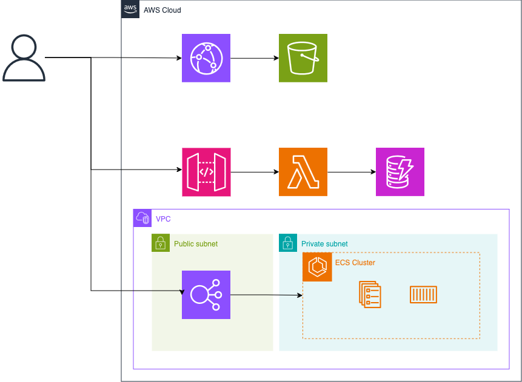

# CDK Illuminations for AWS Summit 2024

## directories

- `doc/`: 各種ドキュメント・画像
- `lambda/`: Lambda 関数で動作するプログラム
- `scripts/`: 各種ツール用スクリプト
- `src/`: CDK Illuminations アプリケーション

## getting started

```
npx projen deploy BaseStack
```

## scripts

- `deploy-destroy-stack.py`: CDK Illuminations スタックの作成・削除を繰り返します
- `describe-stack.py`: CDK Illuminations スタックのリソースを監視し、作成状況を出力します

```
(terminal1)
python3 deploy-destroy-stack.py

(terminal2)
python3 describe-stack.py
```

別タブで2つのプログラムを起動してください。

## architecture

- CDK Illuminations アプリケーションでは以下のアーキテクチャがデプロイされる。


