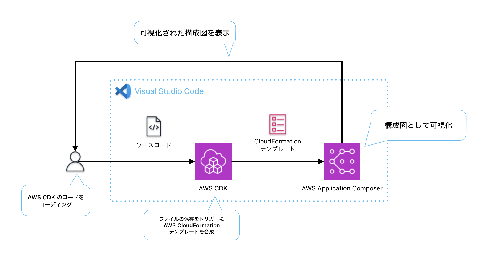

# AWS Summit D-07 AWS の構成図をリアルタイムに描いてみる

このリポジトリは AWS Summit 2024 D-07 ブースで展示していたデモに使っているソースコードです。
この AWS CDK プロジェクトは `cdk init` コマンドで初期化したプロジェクトに、ファイルを保存する度に `cdk synth` を実行するコマンドを追加しただけのプロジェクトです。自動的に `cdk synth` を実行させることで AWS Toolkit の AWS Application Composer から AWS CDK アプリケーションの構成を(ニア)リアルタイムに可視化させることができます。

## デモ

### Amazon Simple Queue Service (Amazon SQS) で Dead Letter Queue を設定するデモ

https://github.com/WinterYukky/aws-summit-2024-iac-booth-demo/assets/49480575/5d915bfd-23d4-43de-9357-ef1c75b416b0

### Amazon Simple Storage Service (Amazon S3) と Amazon CloudFront のフロントエンドアプリケーションのデモ

https://github.com/WinterYukky/aws-summit-2024-iac-booth-demo/assets/49480575/23f0a3c4-2a28-462d-bdcb-90c14b6ff480

## 利用方法

1. このリポジトリをクローンする
   1. 既存のプロジェクトで利用する場合は `npm i nodemon` を実行して必要なパッケージを取得します
   1. `package.json` の `scripts` に `"auto-synth": "nodemon -e ts --ignore cdk.out --exec 'npm run cdk synth'"`を追加
1. `npm run auto-synth` を実行
1. `cdk.out` にあるテンプレートファイルを右クリックして `Open with Application Composer` を選択
1. AWS CDK アプリケーションを編集する
